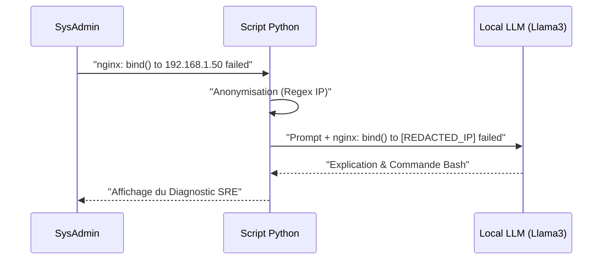

#  AIOps Local Log Whisperer

Fini d'envoyer les logs de production sensibles ou les adresses IP internes vers les serveurs cloud d'OpenAI. Cet outil est un assistant SysAdmin (SRE) piloté par l'IA qui tourne **100% en local**. 

Il intercepte une ligne de log, censure rudimentairement les données sensibles (PII/IP) via Regex, et interroge une instance locale d'Ollama (LLM) pour fournir instantanément un diagnostic et une commande Bash de remédiation.

## 🏗️ Architecture "Privacy-First"


# Fonctionnalités
Privacy-First : Les données ne quittent jamais l'infrastructure de l'entreprise.

Censure Automatique : Masquage des adresses IPv4 avant l'envoi au modèle.

Intégration Ollama : Conçu pour fonctionner de pair avec Llama 3, Mistral, ou Qwen en local.

# Prérequis & Installation
Installez et lancez le démon Ollama sur votre machine/serveur.

Téléchargez un modèle léger (ex: ollama run llama3).

```bash
git clone https://github.com/FilouCosmos/aiops-local-log-whisperer.git
cd aiops-local-log-whisperer
pip install -r requirements.txt
```
# Utilisation
Passez simplement votre ligne de log problématique entre guillemets en argument du script :
```bash
python3 log_whisperer.py "nginx: [emerg] bind() to 192.168.1.50:80 failed (98: Address already in use)"
```
